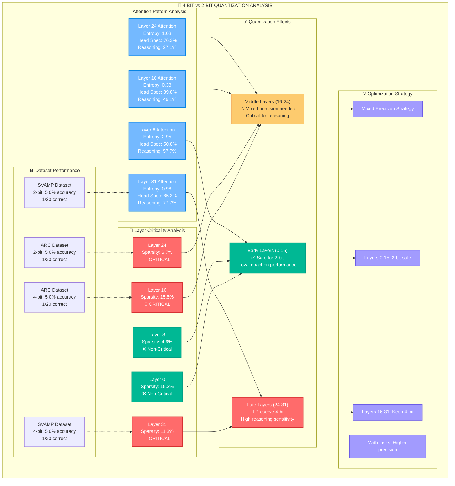

# Quantization Analysis Overview

## 4-bit vs 2-bit Strategic Analysis

## Key Findings

**Critical Layers Identified:**
- 🔴 Layer 16: 15.5% sparsity, critical for reasoning
- 🔴 Layer 24: 6.7% sparsity, high attention specialization  
- 🔴 Layer 31: 11.3% sparsity, highest reasoning score (77.7%)

**Optimization Strategy:**
- ✅ **Layers 0-15**: Safe for 2-bit quantization
- ⚠️ **Layers 16-24**: Mixed precision recommended
- 🔴 **Layers 24-31**: Preserve 4-bit for optimal performance 